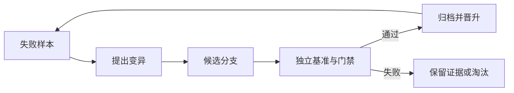

# nature-compiler

> Transformer 是带先验的搜索器，`Blueprint` 是语义边界，编译器负责把概率提案提交为可审查、可重复生成的工程事实。

`nature-compiler` 把产品经理的中文需求编译为可审查、可重复生成、可通过门禁验证的 Rust
代码。AI 只负责把母语推导成强类型 `Blueprint`，编译器负责命名、引用、能力解析、策略校验、
源码布局和内容摘要。产品输入不填写 `code`、`kind`、字典编码、Provider 标识、Rust 类型、表名
或文件路径。

项目的基本判断是：**token 空间适合探索，artifact 空间才适合结算。** 模型可以提出候选结构，
但只有通过类型、策略、能力和构建门禁的结果，才应成为后续系统可以依赖的产物。

## 为什么不是直接让 AI 写代码

传统 Coding Agent 往往把源码、IR、内存、控制流和运行日志都混在同一段上下文中。Prompt 是
无类型源码，思维链同时充当临时 IR 和日志，Context 类似巨型可变全局变量，普通 compact 则是
有损 checkpoint。系统很难判断一句生成内容究竟是建议、假设，还是已经可以依赖的事实。

`nature-compiler` 把这条路径改成：


可以把它概括为：

```text
概率提案 -> 规范化 -> 类型检查 -> 能力解析 -> 策略验证 -> 确定性生成 -> 内容寻址
```

确定性不来自把温度设为零，而来自受控边界、独立门禁和可重放的生成过程。编译器正确性的核心
也是语义保持，而不是输出字节更少；CompCert 对真实编译器的形式化验证给出了经典范例
[[2]](#ref-2)。

## 语义压缩

代码、编译器和库都包含压缩，但它们不只是压缩。

- 编译是语义保持的变换、规范化和部分求值。
- 库是共享字典。调用方用一个稳定符号引用实现、契约、测试和文档。
- API 调用是压缩后的编码，链接与执行按共享字典展开。
- API 版本不一致，相当于编码器和解码器使用了不同字典。
- AI 幻觉出不存在的 API，相当于链接器遇到未知符号却没有报错。

因此，库更准确的定义是：**经过命名、封装和验证的语义压缩。** 压缩收益来自跨调用复用，
而不是源文件更短。最小描述长度原则提供了一个相近的理论视角：好的模型需要同时控制模型自身
的描述长度和解释数据所需的描述长度 [[1]](#ref-1)。

这也意味着“所有东西都拆成 lib”并不是目标。过度拆分会把复杂度转移到依赖关系、版本组合和
隐式协议中。一个值得固化的能力边界至少应满足：

- 契约比实现稳定；
- 调用方需要知道的信息更少；
- 输入、输出和副作用明确；
- 能够独立验证；
- 组合后仍然可以推理；
- 修改影响范围可以计算。

## 编译器边界

当前实现刻意保持一条窄而严格的可信路径。

| 阶段 | 责任 | 失败行为 |
| --- | --- | --- |
| `SourceContract` | 拒绝产品输入中的机器协议和实现细节 | 返回母语诊断，不执行推导 |
| `Inference` | 将母语推导为唯一中间表示 `Blueprint` | 不允许返回 Rust、SQL、脚本或目标路径 |
| `CapabilityResolution` | 从宿主目录唯一解析能力并执行 lowering | 无匹配或多匹配时拒绝猜测 |
| `BlueprintPolicy` | 校验代码身份、引用、路由、权限和字段绑定 | 存在错误时不生成 artifact |
| `RustGeneration` | 从同一 `Blueprint` 确定性生成 Rust | 返回按内容计算摘要的 `ArtifactSet` |

`Compiler::compile` 本身不写文件、不运行 Cargo，也不执行发布动作。数据库、文件写入、构建、
部署和回滚都由宿主掌握。这个边界让生成器保持纯净，也让副作用可以在更高层被授权和审计。

真实 AI 适配器实现 `InferenceEngine`，但只能返回 `Blueprint` 中定义的强类型推导树。
能力实现 `CapabilityProvider`，由宿主聚合为 `CompilerCatalog`；新增能力不修改编译器分支。

首版内置一个协议无关的 `fixture.map` 能力：宿主传入
`BTreeMap<String, serde_json::Value>`，生成代码完成字段读取、数值变换和领域校验。

## Blueprint 是提交边界

`Blueprint` 是当前唯一的编译中间表示，也是 AI 与确定性编译器之间的协议。它聚合了需求、
领域模型、操作计划、接口、视图、导航、权限、能力引用、推导决策和默认值，但不包含任意脚本源码。

从设计上可以把其中的信息理解为四个视图，但不会为这些视图再引入互相重叠的持久化协议：

```text
Specification  目标、约束、领域模型、验收语义
Capability     能力身份、配置结构、绑定关系
Plan           类型化操作步骤、接口、导航和权限
Evidence       推导决策、默认值、诊断、变更影响和编译轨迹
```

未来如果需要真正的多阶段 IR，也应由明确的优化或验证需求驱动，而不是复制一套近似 DTO。

对于不可信的生成者，理想产物不只是代码，还应携带可独立检查的证据。Proof-Carrying Code 的
核心思想正是让不可信代码生产者同时提供满足既定安全策略的证明，再由宿主快速检查
[[3]](#ref-3)。`nature-compiler` 当前使用类型、策略、生成测试、诊断和内容摘要作为工程化的
证据基础，形式证明属于长期方向。

## Semantic Compact

普通 compact 是自然语言摘要，容易丢失否定条件、决策原因和未解决问题。适合长期演进的
compact 应当是结构化语义快照，而不是“把过去讲短一点”：

```text
SemanticCompact {
  invariants       // 不允许改变的约束
  decisions        // 已经确定的决策
  interfaces       // 类型、契约和协议
  assumptions      // 尚未验证的假设
  evidence_refs    // 测试、日志、来源和构建记录
  unresolved       // 仍然开放的问题
  artifact_hashes  // 已冻结产物的内容身份
}
```

原始对话可以外置保存，只在快照中保留可追溯引用。这样的 compact 更接近 AST 规范化、数据库
checkpoint、Git commit 和 Merkle DAG。它保留继续正确推导所需的最小充分状态，同时允许回到
原始证据审查信息损失。

`Blueprint`、`CompileTrace`、`BreakingChange` 和 `ArtifactSet::hash` 已经覆盖这个方向的一部分，
但完整的证据引用和内容寻址历史仍属于演进目标。

## 五张图

讨论“AI 图谱”时，需要区分五种不同对象：

1. **计算图**：Attention、MLP 和 residual stream 的张量计算。
2. **特征因果图**：哪些内部特征影响了当前输出。
3. **知识证据图**：一个结论由哪些事实和来源支持。
4. **执行效果图**：Agent 将调用什么、读写什么以及产生什么副作用。
5. **演化谱系图**：某个 Prompt、库、验证器或 Agent 是如何变异出来的。

Transformer 的 superposition 说明一个神经元可能承载多个非正交特征，稀疏自编码器和字典学习
可以提取比单个神经元更单义的分析单元 [[5]](#ref-5)。Attribution graph 进一步尝试把特征组织为
针对具体输入的计算因果图，但现有方法仍依赖近似替代模型，图中可能包含数百个特征和数千条边，
并不能等价为完整的全局程序 [[6]](#ref-6)。

`nature-compiler` 不以完全解释 Transformer 内部为前提。它优先构造后三张外部图：让需求有证据，
执行有类型和效果边界，产物有可追踪谱系。即使内部模型仍然不透明，外部行为也可以被约束。

## 分形、流形与迭代稳定性

严格地说，Mandelbrot 集不是通常意义上的流形，“Mandelbrot manifold”也不是已经成立的
Transformer 架构。Transformer 隐藏表示确实可以用内在维度、邻域结构和表示流形研究；已有工作
观察到表示在跨层传播时出现扩张、收缩以及语义信息集中的阶段 [[4]](#ref-4)。这支持几何分析，
但不证明 Transformer 具有 Mandelbrot 结构。

对工程更有价值的是分形和迭代系统提供的三个设计工具。

### 跨尺度自相似

系统、模块、函数和表达式可以共享同一种能力协议：

```text
Node<Input, Output, Effect> {
  contract
  implementation
  verifier
  cost
  provenance
}
```

缩放任务时，组织原则保持不变。Mandelbrot 对统计自相似和分数维度的经典讨论说明了“观察尺度
改变，复杂度测量也随之改变” [[11]](#ref-11)。在软件中，这提醒我们同时测量节点内部复杂度和
组合边界复杂度，而不是只计算代码行数。

### 语义分岔边界

对同一需求做微小、保持原意的扰动，再比较规范化 `Blueprint`。若轻微措辞变化导致完全不同的
领域结构、能力选择或权限边界，任务就位于高敏感的语义边界。此时系统应请求澄清、保留候选分支
或提高验证强度，而不是继续盲目采样。

### Escape criteria

把 Agent 改进写成迭代：

```text
state[n + 1] = improve(state[n], evidence, constraints)
```

停止条件不应只有固定轮数，还应检测：

- 验证分数不再增加；
- 修改量持续扩大；
- 同一失败反复出现；
- 复杂度增长快于覆盖率；
- 生成器与验证器共同偏移；
- 结果对微小输入扰动高度敏感。

这些条件用于区分收敛、振荡和发散，不用于宣称系统真的运行在 Mandelbrot 集上。

## RSI：受控演化，而不是原地自改写

递归自我改进应先从可验证组件开始，而不是让模型直接覆盖自身：



可以把 RSI 分为六级：

| 级别 | 改进对象 | 工程判断 |
| --- | --- | --- |
| R0 | 当前答案 | 已可工程化 |
| R1 | Prompt、上下文和记忆策略 | 可通过回放集验证 |
| R2 | 工具、能力库、IR 和工作流 | `nature-compiler` 的主要长期落点 |
| R3 | 验证器和测试生成器 | 必须防止裁判与选手共同漂移 |
| R4 | 模型权重 | 成本高，要求独立数据和评估 |
| R5 | 目标、奖励和治理规则 | 不应由系统自行闭环 |

理论上的 Gödel Machine 要求系统在证明自修改有益后才执行修改 [[7]](#ref-7)。现实系统很难为
开放世界收益给出这种证明。Darwin Gödel Machine 采用了更工程化的近似：保留自修改 Agent 的
演化树，以外部 coding benchmark 评估候选，而不是原地覆盖唯一版本 [[8]](#ref-8)。

`nature-compiler` 对 RSI 的核心约束是：

> 生成器可以改进，但必须存在它不能随意改写的外部真值锚点。

适合先闭环的领域包括编译、测试、定理证明、数据库约束、模拟任务以及延迟和内存优化。模型只用
自己的输出训练下一代会积累分布偏差并丢失尾部信息，最终可能发生 model collapse
[[9]](#ref-9)。验证过的合成数据可以缓解这一问题，但改进上限仍由验证器的质量决定
[[10]](#ref-10)。

因此候选版本应在不可变分支中生成，并同时满足功能、安全、成本和复杂度门禁。一个可用的长期
目标函数是：

```text
J = verified_coverage
    - lambda * description_length
    - mu * runtime_cost
    - nu * operational_risk
```

目标不是得到更短的回答，而是找到更小、更稳定的语义内核，覆盖更多经过验证的行为。

## 最小用法

```rust,no_run
use std::sync::Arc;

use nature_compiler::{
    CompileRequest, Compiler, CompilerCatalog, MotherTongueInferenceEngine,
};

const SOURCE: &str = r#"领域：冷链环境监测

需求：
1. 采集冷库温度和湿度，异常数据不能进入遥测记录
2. 运维人员可以查询历史遥测并按采集时间筛选
3. 有效数据到达后更新设备的数据活性时间

建模：环境遥测
1. 温度：小数，摄氏度，必填，范围 -40 到 125
2. 湿度：小数，百分比，必填，范围 0 到 100

操作：
1. 接收遥测时转换温度和湿度原值，校验通过后保存
2. 查询遥测时支持按采集时间筛选并返回分页结果
3. 删除遥测前必须确认，删除后返回处理结果

界面：遥测记录
1. 使用表格展示温度和湿度
2. 支持筛选、刷新和删除操作

界面：遥测详情
1. 使用只读表单展示单条遥测及校验结果

导航：
1. 在“设备运维”下面显示“环境监测”
2. 遥测记录作为默认页面

权限：
1. 运维人员可以查看遥测记录
2. 管理员可以删除异常遥测

数据获取：
1. 模拟采集提供温度原值和湿度原值
2. 温度等于温度原值除以 10
3. 湿度等于湿度原值除以 10
"#;

#[tokio::main]
async fn main() -> anyhow::Result<()> {
    let compiler = Compiler::new(
        Arc::new(MotherTongueInferenceEngine),
        CompilerCatalog::with_fixture_map(),
    );
    let result = compiler
        .compile(CompileRequest {
            source_text: SOURCE.to_string(),
            previous_blueprint: None,
        })
        .await?;

    assert!(result.artifacts.is_some());
    Ok(())
}
```

运行完整示例：

```bash
cargo run --example compile_environment
```

## 生成布局

生成物固定为结构型布局：

```text
application.json
blueprint.json
src/lib.rs
src/structs.rs
src/enums.rs
src/functions.rs
src/validators.rs
src/bindings.rs
src/descriptors.rs
tests/generated.rs
```

同一语义输入和同一编译器版本应生成相同的文件集合与 SHA-256 摘要。仓库测试还会把生成文件写入
临时 crate，并实际执行 `cargo test`，确认生成代码能够编译和运行测试。

## 当前范围

已经实现：

- 中文母语需求的确定性降级推导器；
- 可替换的 `InferenceEngine` 边界；
- 唯一强类型 `Blueprint`；
- 开放的 `CapabilityProvider` 与宿主能力目录；
- 机器协议泄漏、能力歧义、引用和路由门禁；
- 改名后的代码身份重算和破坏性影响报告；
- 确定性 Rust、Blueprint 和应用快照生成；
- 编译阶段与 token 用量观测；
- 内容摘要、快照测试以及生成 crate 的真实构建测试。

尚未宣称实现：

- 通用自然语言理解；
- 形式化语义证明；
- 完整的 effect system；
- 内容寻址的长期证据仓库；
- 自动晋升的 RSI 生产闭环；
- Transformer 内部机制的完整解释。

## 研究基础与论文

<a id="ref-1"></a>[1] Jorma Rissanen. [Modeling by Shortest Data Description](https://doi.org/10.1016/0005-1098(78)90005-5). *Automatica*, 14(5):465-471, 1978.

<a id="ref-2"></a>[2] Xavier Leroy. [Formal Verification of a Realistic Compiler](https://doi.org/10.1145/1538788.1538814). *Communications of the ACM*, 52(7):107-115, 2009.

<a id="ref-3"></a>[3] George C. Necula. [Proof-Carrying Code](https://doi.org/10.1145/263699.263712). *POPL*, pages 106-119, 1997.

<a id="ref-4"></a>[4] Lucrezia Valeriani, Diego Doimo, Francesca Cuturello, Alessandro Laio, Alessio Ansuini, and Alberto Cazzaniga. [The Geometry of Hidden Representations of Large Transformer Models](https://proceedings.neurips.cc/paper_files/paper/2023/hash/a0e66093d7168b40246af1cddc025daa-Abstract-Conference.html). *NeurIPS 2023*.

<a id="ref-5"></a>[5] Trenton Bricken, Adly Templeton, Joshua Batson, et al. [Towards Monosemanticity: Decomposing Language Models With Dictionary Learning](https://transformer-circuits.pub/2023/monosemantic-features/). *Transformer Circuits Thread*, 2023.

<a id="ref-6"></a>[6] Emmanuel Ameisen, Jack Lindsey, Adam Pearce, et al. [Circuit Tracing: Revealing Computational Graphs in Language Models](https://transformer-circuits.pub/2025/attribution-graphs/methods.html). *Transformer Circuits Thread*, 2025.

<a id="ref-7"></a>[7] Juergen Schmidhuber. [Goedel Machines: Self-Referential Universal Problem Solvers Making Provably Optimal Self-Improvements](https://arxiv.org/abs/cs/0309048). arXiv:cs/0309048, 2003.

<a id="ref-8"></a>[8] Jenny Zhang, Shengran Hu, Cong Lu, Robert Lange, and Jeff Clune. [Darwin Godel Machine: Open-Ended Evolution of Self-Improving Agents](https://arxiv.org/abs/2505.22954). arXiv:2505.22954, 2025.

<a id="ref-9"></a>[9] Ilia Shumailov, Zakhar Shumaylov, Yiren Zhao, Nicolas Papernot, Ross Anderson, and Yarin Gal. [AI Models Collapse When Trained on Recursively Generated Data](https://doi.org/10.1038/s41586-024-07566-y). *Nature*, 631:755-759, 2024.

<a id="ref-10"></a>[10] Yunzhen Feng, Elvis Dohmatob, Pu Yang, Francois Charton, and Julia Kempe. [Beyond Model Collapse: Scaling Up with Synthesized Data Requires Verification](https://arxiv.org/abs/2406.07515). arXiv:2406.07515, 2024.

<a id="ref-11"></a>[11] Benoit B. Mandelbrot. [How Long Is the Coast of Britain? Statistical Self-Similarity and Fractional Dimension](https://doi.org/10.1126/science.156.3775.636). *Science*, 156(3775):636-638, 1967.

与本项目最接近的近期 Agent 编译探索还包括 Abhiram Chivukula、Jay Somasundaram 和
Vijay Somasundaram 的 [Agint: Agentic Graph Compilation for Software Engineering Agents](https://openreview.net/forum?id=0cxwLB6FHK)，其核心方向是把自然语言工作流逐步降低为带类型和 effect 的执行图。`nature-compiler`
与其共享“生成必须经过结构化 IR”这一判断，但选择以领域 `Blueprint`、宿主能力目录和确定性
Rust 后端为当前实现边界。

## License

`MIT OR Apache-2.0`
